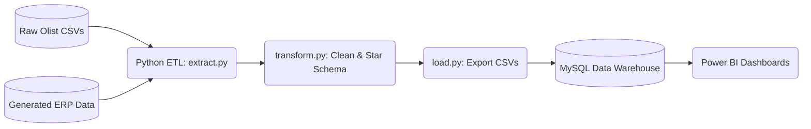

# Enterprise Retail Analytics Platform

This project transforms the raw Brazilian Olist E-Commerce dataset into a production-grade Enterprise Retail Analytics Platform. It is designed to mirror the architecture of modern retail companies (like Nestasia, Amazon, and Wayfair), integrating transactional data with ERP, CRM, and Supply Chain systems into a centralized Star Schema Data Warehouse.

## Business Case
The goal of this platform is to provide executives and analysts with actionable insights into revenue growth, customer lifetime value, marketing efficiency, inventory health, and operational logistics. By bridging the gap between flat operational data and dimensional analytical data, the organization can scale its business intelligence capabilities.

### Key Performance Indicators (KPIs)
- **Revenue & Profitability**: Gross Revenue, Net Profit, Profit Margin.
- **Customer Health**: CLV, Repeat Purchase Rate, Customer Acquisition Cost (CAC).
- **Supply Chain**: Inventory Turnover, Stock Out Rate, Fill Rate.
- **Marketing**: Return on Ad Spend (ROAS), Cost Per Acquisition (CPA).
- **Operations**: On-Time Delivery Rate, Return Rate, Net Promoter Score.

---

## Architecture Overview

The system follows a modern ELT/ETL pipeline architecture:

1. **Extraction**: Python extracts 9 raw Olist CSVs and 5 synthetic ERP datasets (`Product_Master`, `Inventory`, `Customer_Profile`, `Marketing_Campaign`, `Warehouse`).
2. **Transformation**: The pipeline cleans data, handles nulls, normalizes Indian geographical data, standardizes currencies, generates Surrogate Keys, and builds the Star Schema (Dimensions and Facts).
3. **Load**: 17 modeled datasets are exported to `data/warehouse_export/`.
4. **Data Warehouse**: MySQL 8.0 ingests the data into a normalized Star Schema protected by Foreign Keys, utilizing B-Tree indexes, analytical Views, and Stored Procedures mimicking Materialized Views.
5. **Business Intelligence**: Power BI connects to the Data Warehouse to visualize 50+ DAX measures across 6 Executive Dashboards.

### ETL Flow Diagram



---

## Star Schema Design

The Data Warehouse operates on a strict Kimball Star Schema.

### Dimension Tables
- `Dim_Date`, `Dim_Product`, `Dim_Category`, `Dim_Customer`, `Dim_Seller`, `Dim_Geography`, `Dim_Warehouse`, `Dim_Campaign`, `Dim_Payment`, `Dim_Shipping`

### Fact Tables
- `Fact_Sales`, `Fact_Inventory`, `Fact_Marketing`, `Fact_Returns`, `Fact_Reviews`, `Fact_Payments`, `Fact_Shipping`

---

## Project Structure

```text
project/
├── data/
│   ├── raw/                  # Original Olist datasets
│   ├── processed/            # Cleaned Olist datasets
│   ├── erp_crm/              # Synthesized enterprise datasets
│   └── warehouse_export/     # Final Star Schema (Dims & Facts)
├── scripts/
│   ├── extract.py            # Loads raw & ERP data
│   ├── transform.py          # Data cleaning & Dimensional modeling
│   ├── load.py               # Exports Star Schema to CSV
│   ├── quality.py            # Generates DWH Quality Report
│   ├── generate_erp_data.py  # Generates 5 realistic ERP datasets
│   ├── config.py             # Global paths and settings
│   ├── logger.py             # Centralized logging
│   └── main.py               # Orchestrates the ETL pipeline
├── data_warehouse/
│   ├── 01_schema.sql         # DDL for Dimensions and Facts
│   ├── 02_indexes.sql        # Foreign keys and B-Tree indexes
│   ├── 03_views.sql          # Core analytical views
│   ├── 04_stored_procedures.sql # SCDs and MV procedures
│   └── 05_reporting_layer.sql # Materialized summary tables
├── reports/                  # Data quality JSON reports
├── logs/                     # Application logs
└── README.md                 # This documentation
```

---

## Deployment Guide

### 1. Environment Setup
```bash
# Create a virtual environment using uv
uv venv
source .venv/bin/activate  # On Windows: .venv\Scripts\activate
uv pip install pandas numpy
```

### 2. Generate ERP Data
```bash
python scripts/generate_erp_data.py
```

### 3. Run the ETL Pipeline
Executes extraction, star schema transformation, quality reporting, and exporting.
```bash
python scripts/main.py
```

### 4. Deploy the MySQL Data Warehouse
Execute the SQL scripts in order against your MySQL instance:
```bash
mysql -u root -p < data_warehouse/01_schema.sql
mysql -u root -p < data_warehouse/02_indexes.sql
mysql -u root -p < data_warehouse/03_views.sql
mysql -u root -p < data_warehouse/04_stored_procedures.sql
mysql -u root -p < data_warehouse/05_reporting_layer.sql
```
*Note: Use `LOAD DATA INFILE` or a tool like MySQL Workbench to ingest the CSVs from `data/warehouse_export/` into the newly created tables.*

---

## Assumptions & Future Improvements
- **Assumptions**: Missing product prices were imputed using median values. Dates were shifted forward by 8 years (2016-2018 -> 2024-2026) to reflect current timelines. 
- **Future Improvements**:
  - Implement Apache Airflow for DAG orchestration.
  - Migrate MySQL to Snowflake or Google BigQuery.
  - Add dbt (Data Build Tool) to replace Python for dimensional modeling.
